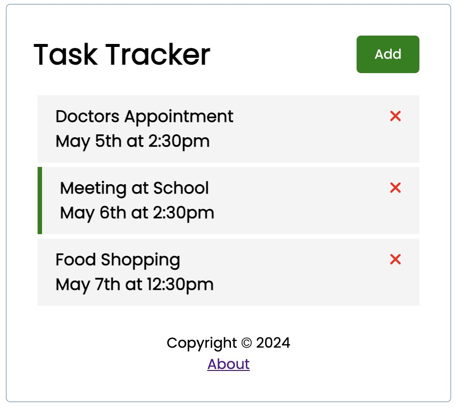

# Angular Task Tracker 📝

<h4 align="center">Anuglar practice project</h4>

<h4 align="center">

</h4>

## Features 🔍

- Show tasks
- Add task
- Update task
- Delete task

## Technology 🖥️

This project was generated with [Angular CLI](https://github.com/angular/angular-cli) version 17.3.5.

The mock rest json server was implemented by [json-server](https://github.com/typicode/json-server).

## Installation and Setup ⚙️

1. Run the mock server: `npm run server`
2. Run the project in development mode: `ng serve`
3. View the website from: http://localhost:4200/
4. If needed, view the server from: http://localhost:3000/
